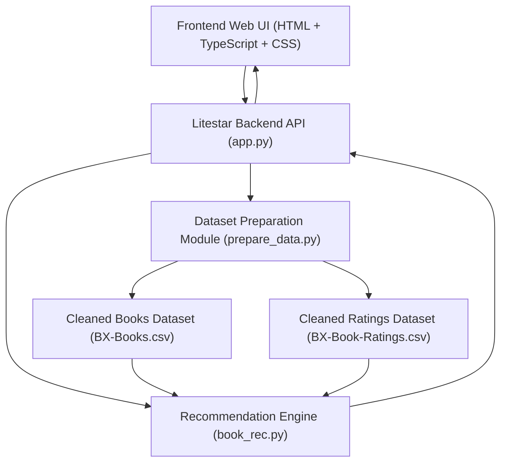
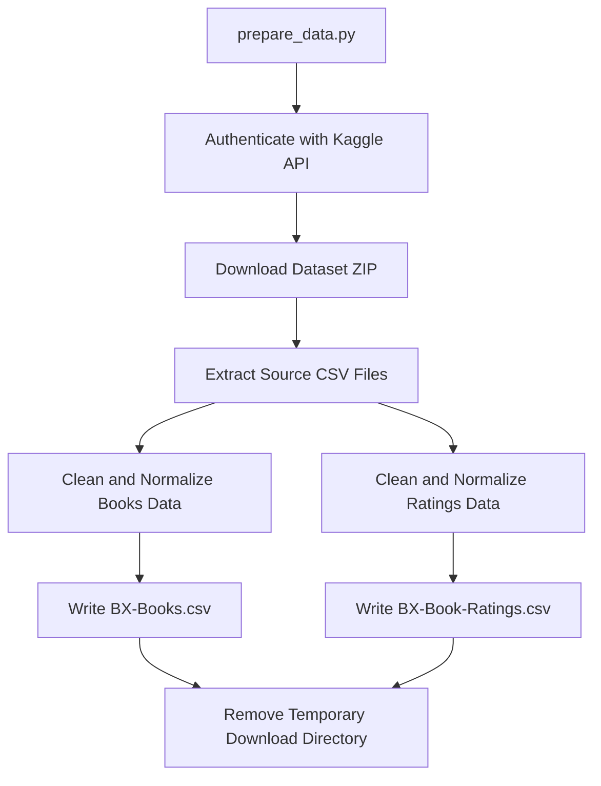

# Book Recommender Web App

Web app with:
- Litestar backend (`app.py`)
- Minimal TypeScript/HTML/CSS frontend (`frontend/*`)
- Data preparation pipeline (`prepare_data.py`)
- Recommendation engine (`book_rec.py`)

## Current Functionality

- Download + clean source dataset from Kaggle using a button in the UI.
- Keep cleaned CSVs (`BX-Books.csv`, `BX-Book-Ratings.csv`) in project folder.
- Request recommendations via API and display them in a table in browser.
- Use typo-tolerant title resolution (nearest title match from dataset).
- Get live title suggestions in GUI based on dataset content.
- Run fully in Docker on Windows.

## Architecture



## API Endpoints

- `GET /` -> serves web UI
- `GET /api/health` -> health check
- `POST /api/prepare-data` -> runs Kaggle download + ETL
- `POST /api/recommend` -> returns recommendations, including matched title and metrics
- `GET /api/title-suggestions?q=<query>&top_n=<n>` -> returns title suggestions from dataset

Example request body for `POST /api/recommend`:

```json
{
  "target_title": "the fellowship of the ring (the lord of the rings, part 1)",
  "target_author_substring": "tolkien",
  "rating_threshold": 8,
  "top_n": 10
}
```

Example response body for `POST /api/recommend`:

```json
{
  "ok": true,
  "matched_title": "the fellowship of the ring (the lord of the rings, part 1)",
  "items": [
    {
      "book": "the two towers (the lord of the rings, part 2)",
      "corr": 0.81,
      "avg_rating": 8.74,
      "rating_count": 129
    }
  ]
}
```

Example response body for `GET /api/title-suggestions`:

```json
{
  "ok": true,
  "items": [
    {
      "title": "harry potter and the chamber of secrets (book 2)",
      "author": "j. k. rowling",
      "rating_count": 273,
      "avg_rating": 8.12
    }
  ]
}
```

## Recommendation Metrics (Important)

- `rating_threshold` currently means **minimum rating count** (number of ratings/users for a title in the comparison set), not minimum average score.
- `avg_rating` is the mean score for each recommended title and can be below 8 even when `rating_threshold = 8`.
- `corr` is Pearson correlation between target book and candidate book ratings.
- `rating_count` is a popularity/reliability metric (how many ratings contributed for that title in the filtered set).

## `prepare_data.py` Flow

1. Authenticate with Kaggle (`kaggle.json`).
2. Download dataset archive.
3. Extract source CSV files.
4. Clean books data:
   - normalize text/ISBN
   - parse year
   - remove invalid rows
   - deduplicate by `ISBN`
5. Clean ratings data:
   - normalize ISBN
   - parse numeric fields
   - enforce rating range `[0, 10]`
   - deduplicate by `(User-ID, ISBN)`
6. Save cleaned output files.
7. Remove temporary download folder (unless `--keep-downloads`).



## Local Run (without Docker)

```bash
pip install -r requirements.txt
uvicorn app:app --host 0.0.0.0 --port 8000
```

Open [http://localhost:8000](http://localhost:8000).

## Docker Run on Windows

### 1) Install Docker Desktop

1. Install [Docker Desktop for Windows](https://www.docker.com/products/docker-desktop/).
2. Enable WSL2 integration during setup.
3. Start Docker Desktop and wait until it shows "Engine running".

### 2) Verify Docker in PowerShell

```powershell
docker --version
docker compose version
```

### 3) Kaggle credentials

- Put credentials at: `C:\Users\<you>\.kaggle\kaggle.json`
- JSON format:

```json
{"username":"your_kaggle_username","key":"your_kaggle_api_key"}
```

### 4) Build and run app

From `book_recommender` folder:

```powershell
docker compose build
docker compose up
```

Then open [http://localhost:8000](http://localhost:8000).

### 5) Stop app

```powershell
docker compose down
```

### 6) Rebuild after code changes

If backend or frontend files change:

```powershell
docker compose down
docker compose up --build
```

## Deploy to AWS EC2 (Docker + Secrets Manager)

This project includes `docker-compose.aws.yml` for EC2 deployment.

### Security model

- Kaggle credentials are **not** stored in source code, Docker image, or compose env vars.
- Credentials are stored in **AWS Secrets Manager**.
- EC2 fetches the secret to local runtime file: `./secrets/kaggle.json`.
- Container mounts it read-only to `/root/.kaggle/kaggle.json`.

### 1) Create secret in AWS Secrets Manager

In AWS Console:
- Open **Secrets Manager** -> **Store a new secret**
- Secret type: **Other type of secret**
- Plaintext JSON:

```json
{"username":"your_kaggle_username","key":"your_kaggle_api_key"}
```

- Secret name: `book-recommender/kaggle`

### 2) Create IAM role for EC2

Create an EC2 role with permission to read that secret:
- `secretsmanager:GetSecretValue` on `book-recommender/kaggle`

Attach this IAM role to your EC2 instance (instance profile).

### 3) Launch EC2 instance

- OS: Ubuntu 22.04/24.04
- Instance type: free-tier eligible (`t2.micro` or equivalent)
- Security Group inbound:
  - `SSH` (Type SSH) from **My IP**
  - `HTTP` (Type HTTP) from `0.0.0.0/0`
- Keep outbound default allow.

### 4) Connect to EC2

From local terminal:

```bash
ssh -i /path/to/keypair.pem ubuntu@<EC2_PUBLIC_IP>
```

### 5) Install runtime dependencies on EC2

```bash
sudo apt update
sudo apt install -y docker.io docker-compose-v2 git unzip
curl "https://awscli.amazonaws.com/awscli-exe-linux-x86_64.zip" -o "awscliv2.zip"
unzip awscliv2.zip
sudo ./aws/install
aws --version
```

### 6) Upload or clone project

Option A: clone from git

```bash
git clone <your-repo-url>
cd <repo-root>/book_recommender
```

Option B: copy from local machine with `scp`.

### 7) Fetch Kaggle secret on EC2

```bash
chmod +x scripts/fetch_kaggle_secret.sh
./scripts/fetch_kaggle_secret.sh book-recommender/kaggle ./secrets/kaggle.json
```

### 8) Build and run on EC2

```bash
docker compose -f docker-compose.aws.yml up -d --build
docker ps
curl http://localhost/api/health
```

Then open:
- `http://<EC2_PUBLIC_IP>`

### 9) Operations

```bash
docker compose -f docker-compose.aws.yml logs -f
docker compose -f docker-compose.aws.yml restart
docker compose -f docker-compose.aws.yml down
```

## Security Notes

- Keep private key files (`*.pem`) outside repository when possible.
- `secrets/` is git-ignored and docker-ignored to prevent accidental secret leaks.
- Never commit `kaggle.json`, `.env`, or credential files.

## Configurable values

In `book_rec.py`:
- `TARGET_TITLE`
- `TARGET_AUTHOR_SUBSTRING`
- `BOOK_RATE_THRESHOLD`
- `LOG_LEVEL`

In `prepare_data.py`:
- `DATASET_SLUG`
- `LOG_LEVEL`
