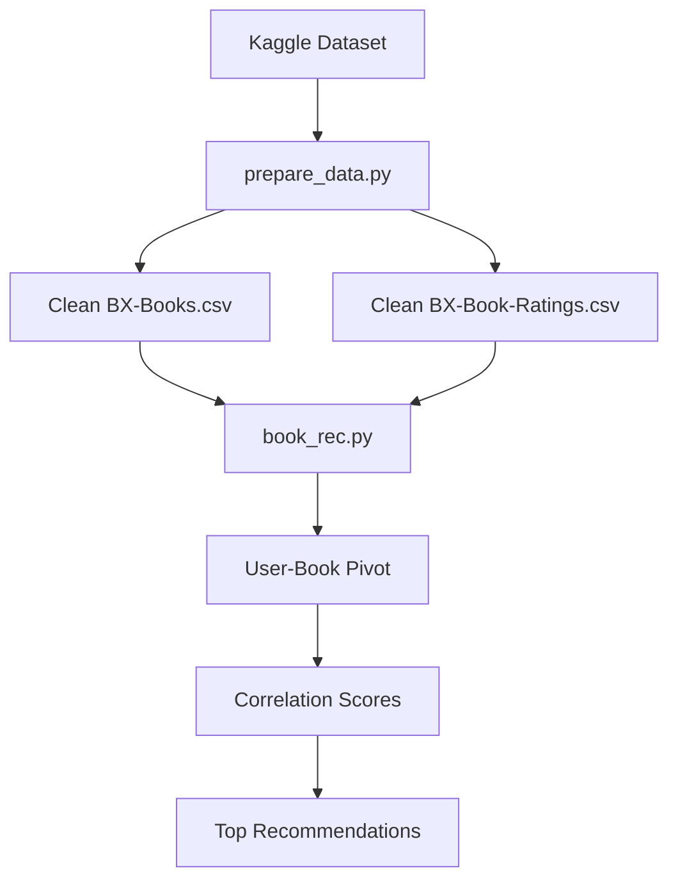
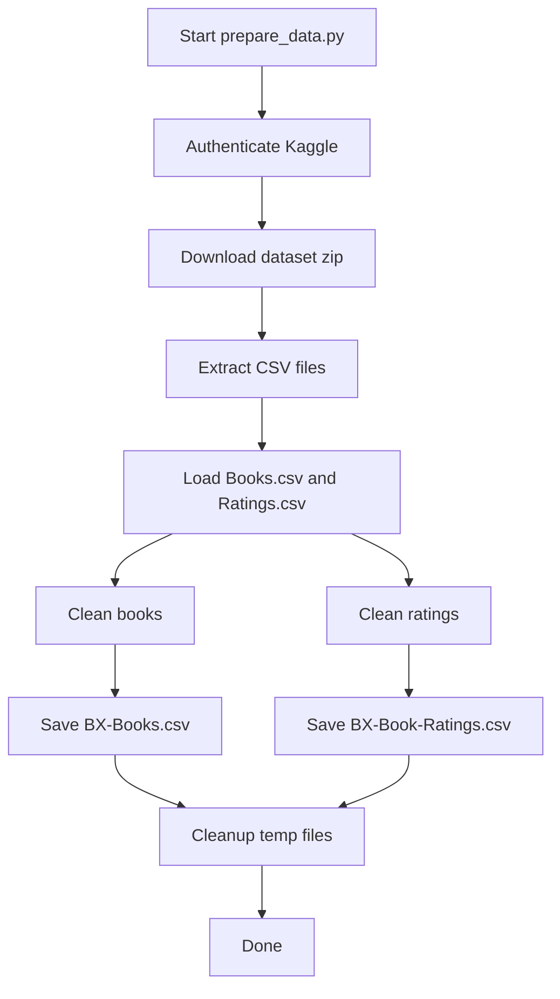

# Book Recommender

Simple collaborative filtering script based on user rating correlations.

## What This Project Does

- Downloads the Book-Crossing-style dataset from Kaggle.
- Runs a lightweight ETL (`prepare_data.py`) to normalize and clean source CSV files.
- Builds a user-book rating matrix in `book_rec.py`.
- Computes Pearson correlation scores to recommend books similar to a target title.
- Prints top recommendations with correlation and average rating.

## Architecture



## Setup

```bash
pip install -r requirements.txt
```

Required packages are pinned in `requirements.txt` for reproducibility.

## Download and Prepare Data

1. Set Kaggle credentials (`~/.kaggle/kaggle.json`).
2. Run:

```bash
python prepare_data.py
```

This downloads `arashnic/book-recommendation-dataset`, cleans the source files, and writes:
- `BX-Books.csv`
- `BX-Book-Ratings.csv`

Optional flag:

```bash
python prepare_data.py --keep-downloads
```

This keeps the temporary `_downloads` folder instead of deleting it.

### `prepare_data.py` Flow (simple ETL)

1. Authenticate with Kaggle API and download dataset zip.
2. Extract CSV files from the archive.
3. Load `Books.csv` and `Ratings.csv`.
4. Clean books data (column normalization, text cleanup, year parsing, dedup by ISBN).
5. Clean ratings data (column mapping, numeric parsing, rating-range filter, dedup by `(User-ID, ISBN)`).
6. Save cleaned outputs as `BX-Books.csv` and `BX-Book-Ratings.csv`.
7. Remove temporary download folder (unless `--keep-downloads` is used).



## Run

```bash
python book_rec.py
```

## Recommender Details (`book_rec.py`)

- Loads `BX-Book-Ratings.csv` and filters out implicit ratings (`Book-Rating == 0`).
- Loads `BX-Books.csv` and merges on `ISBN`.
- Normalizes text columns to lowercase for reliable matching.
- Selects users who rated the target title and match target author substring.
- Keeps titles with at least `BOOK_RATE_THRESHOLD` ratings among those users.
- Builds a pivot table (`User-ID` x `Book-Title`) and computes correlations to the target title.
- Prints top 10 correlated books.

Configurable constants in `book_rec.py`:

- `TARGET_TITLE`
- `TARGET_AUTHOR_SUBSTRING`
- `BOOK_RATE_THRESHOLD`
- `LOG_LEVEL`

## Notes

- Keep `BX-Book-Ratings.csv` and `BX-Books.csv` in this folder.
- Change `TARGET_TITLE` in `book_rec.py` to generate recommendations for another seed book.
- Control verbosity with `LOG_LEVEL` (`DEBUG`, `INFO`, `WARNING`).
- `prepare_data.py` logs high-level progress at `INFO`; row-level/filter diagnostics are at `DEBUG`.
