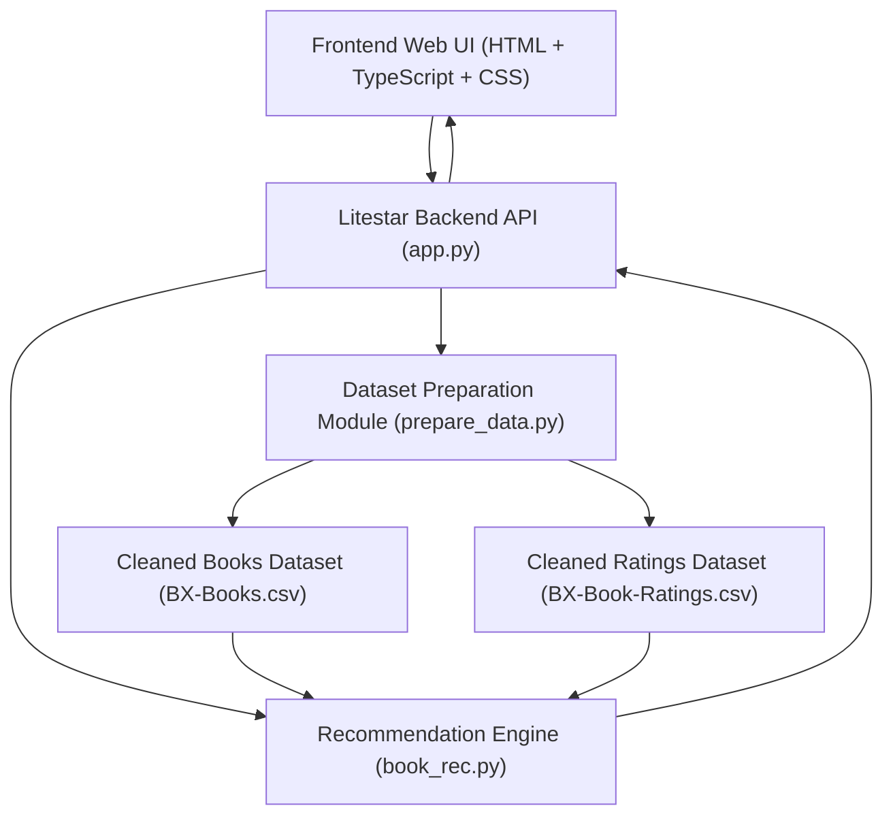
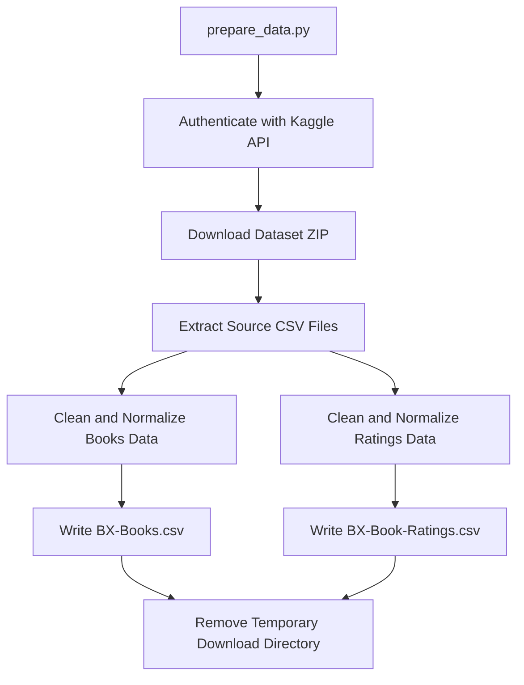

# Book Recommender Web App

A Dockerized book recommendation system with a Litestar API, simple web UI, Kaggle-based data preparation, typo-tolerant title matching, and AWS EC2 deployment support.

**Live Demo (AWS EC2):** [http://13.51.146.150](http://13.51.146.150)

---

## System Overview

This section explains what the system does and how its parts fit together. Deployment steps are in the next section.

### What It Does

- Downloads and cleans the source dataset from Kaggle.
- Stores cleaned files as `BX-Books.csv` and `BX-Book-Ratings.csv`.
- Serves a browser UI for:
  - preparing data,
  - searching titles with live suggestions,
  - requesting recommendations.
- Generates recommendations with:
  - nearest title resolution (for typos/inexact input),
  - correlation score,
  - average rating,
  - rating count.

### Core Components

- Backend API: `app.py` (Litestar)
- Recommendation engine: `book_rec.py`
- Data preparation pipeline: `prepare_data.py`
- Frontend: `frontend/index.html`, `frontend/app.ts`, `frontend/styles.css`

### High-Level Architecture



### API Surface (Quick)

- `GET /` - serves web UI
- `GET /api/health` - health check
- `POST /api/prepare-data` - runs Kaggle download + ETL
- `POST /api/recommend` - returns recommendations, matched title, and metrics
- `GET /api/title-suggestions?q=<query>&top_n=<n>` - returns title suggestions from dataset

<details>
<summary><strong>API Examples</strong></summary>

Request body for `POST /api/recommend`:

```json
{
  "target_title": "the fellowship of the ring (the lord of the rings, part 1)",
  "target_author_substring": "tolkien",
  "rating_threshold": 8,
  "top_n": 10
}
```

Response body for `POST /api/recommend`:

```json
{
  "ok": true,
  "matched_title": "the fellowship of the ring (the lord of the rings, part 1)",
  "items": [
    {
      "book": "the two towers (the lord of the rings, part 2)",
      "corr": 0.81,
      "avg_rating": 8.74,
      "rating_count": 129
    }
  ]
}
```

Response body for `GET /api/title-suggestions`:

```json
{
  "ok": true,
  "items": [
    {
      "title": "harry potter and the chamber of secrets (book 2)",
      "author": "j. k. rowling",
      "rating_count": 273,
      "avg_rating": 8.12
    }
  ]
}
```

</details>

### Recommendation Metrics (Important)

- `rating_threshold` means minimum rating count (how many ratings/users are required in comparison set), not minimum average score.
- `avg_rating` is the average score for a recommended title and can be below 8 even when `rating_threshold = 8`.
- `corr` is Pearson correlation between target book and candidate book.
- `rating_count` is a confidence/popularity proxy showing how many ratings contributed.

### Data Preparation Flow



<details>
<summary><strong>Detailed ETL Steps</strong></summary>

1. Authenticate with Kaggle (`kaggle.json`).
2. Download dataset archive.
3. Extract source CSV files.
4. Clean books data:
   - normalize text/ISBN
   - parse year
   - remove invalid rows
   - deduplicate by `ISBN`
5. Clean ratings data:
   - normalize ISBN
   - parse numeric fields
   - enforce rating range `[0, 10]`
   - deduplicate by `(User-ID, ISBN)`
6. Save cleaned output files.
7. Remove temporary download folder (unless `--keep-downloads`).

</details>

---

## Run And Deploy

This section is operational: local run, Docker run on Windows, and AWS EC2 deployment.

### Local Run (Without Docker)

```bash
pip install -r requirements.txt
uvicorn app:app --host 0.0.0.0 --port 8000
```

Open [http://localhost:8000](http://localhost:8000).

### Docker Run On Windows (Primary Local Path)

Quick path:

```powershell
docker compose build
docker compose up
```

Open [http://localhost:8000](http://localhost:8000).

<details>
<summary><strong>Detailed Windows Docker Setup</strong></summary>

1. Install [Docker Desktop for Windows](https://www.docker.com/products/docker-desktop/).
2. Enable WSL2 integration during setup.
3. Start Docker Desktop and wait until it shows "Engine running".

Verify Docker:

```powershell
docker --version
docker compose version
```

Set Kaggle credentials file:

- Path: `C:\Users\<you>\.kaggle\kaggle.json`
- Format:

```json
{"username":"your_kaggle_username","key":"your_kaggle_api_key"}
```

Run from `book_recommender`:

```powershell
docker compose build
docker compose up
```

Stop app:

```powershell
docker compose down
```

Rebuild after code changes:

```powershell
docker compose down
docker compose up --build
```

</details>

### Deploy To AWS EC2 (Docker + Secrets Manager)

The AWS deployment uses `docker-compose.aws.yml` with AWS Secrets Manager for credentials.

#### Security Model (Short)

- Kaggle credentials are not stored in code, image, or compose env values.
- Credentials live in AWS Secrets Manager.
- EC2 fetches secret into `./secrets/kaggle.json`.
- Container mounts that file read-only to `/root/.kaggle/kaggle.json`.

<details>
<summary><strong>Step-by-Step AWS Deployment</strong></summary>

1. Create secret in AWS Secrets Manager:
   - Service: Secrets Manager -> Store a new secret
   - Type: Other type of secret
   - Value:

   ```json
   {"username":"your_kaggle_username","key":"your_kaggle_api_key"}
   ```

   - Secret name: `book-recommender/kaggle`

2. Create IAM role for EC2:
   - Allow `secretsmanager:GetSecretValue` on `book-recommender/kaggle`
   - Attach role to EC2 instance profile

3. Launch EC2:
   - Ubuntu 22.04 or 24.04
   - Free-tier eligible instance (`t2.micro` or equivalent)
   - Inbound rules:
     - `SSH` from My IP
     - `HTTP` from `0.0.0.0/0`

4. Connect from local machine:

   ```bash
   ssh -i /path/to/keypair.pem ubuntu@<EC2_PUBLIC_IP>
   ```

5. Install runtime dependencies:

   ```bash
   sudo apt update
   sudo apt install -y docker.io docker-compose-v2 git unzip
   curl "https://awscli.amazonaws.com/awscli-exe-linux-x86_64.zip" -o "awscliv2.zip"
   unzip awscliv2.zip
   sudo ./aws/install
   aws --version
   ```

6. Upload project:
   - Option A: `git clone <your-repo-url>`
   - Option B: `scp` from local machine

7. Fetch Kaggle secret on EC2:

   ```bash
   chmod +x scripts/fetch_kaggle_secret.sh
   ./scripts/fetch_kaggle_secret.sh book-recommender/kaggle ./secrets/kaggle.json
   ```

8. Build and run:

   ```bash
   docker compose -f docker-compose.aws.yml up -d --build
   docker ps
   curl http://localhost/api/health
   ```

9. Access app:
   - `http://<EC2_PUBLIC_IP>`

</details>

<details>
<summary><strong>AWS Operations Commands</strong></summary>

```bash
docker compose -f docker-compose.aws.yml logs -f
docker compose -f docker-compose.aws.yml restart
docker compose -f docker-compose.aws.yml down
```

</details>

---

## Security Notes

- Keep private key files (`*.pem`) outside repository when possible.
- `secrets/` is git-ignored and docker-ignored to prevent accidental leaks.
- Never commit `kaggle.json`, `.env`, or any credential file.

---

## Configurable Values

In `book_rec.py`:

- `TARGET_TITLE`
- `TARGET_AUTHOR_SUBSTRING`
- `BOOK_RATE_THRESHOLD`
- `LOG_LEVEL`

In `prepare_data.py`:

- `DATASET_SLUG`
- `LOG_LEVEL`
