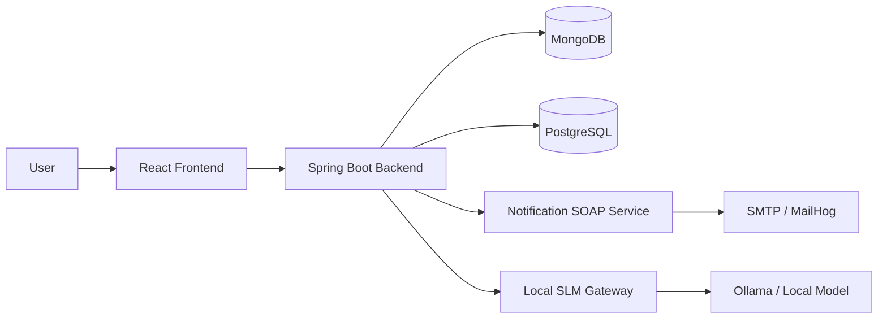

# Poe Pet App

`Poe Pet App` is a virtual-pet web application built primarily as an **educational portfolio project**.  
Its purpose is twofold:

- to practice real-world backend/frontend architecture, refactoring, testing, and deployment thinking
- to produce a project that is substantial enough to present as proof of practical development work

The app combines a classic virtual-pet loop with minigames, customization, economy systems, and an AI-powered pet chat feature backed by a separate local model service.

## Project Summary

At its current stage, the app includes:

- account registration, verification, login, refresh-token auth
- a simulated pet with `hunger`, `happiness`, and `energy`
- a shop, inventory, consumables, cosmetics, **purchasable pet species**, and pet customization
- multiple minigames with reward preview logic
- developer-only tools for fast testing
- AI chat, where the pet can respond in-character through a separate model gateway

This repository follows a **docs-first** approach: behavior, plans, and major architecture decisions are tracked in the documentation before deeper implementation work.

## Educational Purpose

This project is intentionally broader than a minimal CRUD demo. It is used to explore:

- backend architecture in Java/Spring Boot
- API design and error handling
- TypeScript/React UI design
- data modeling trade-offs
- refactoring large components/services into clearer structures
- AI integration with a standalone side project
- SQL history/achievements, containerization, SOAP notification service, and next-step AWS deployment

In other words, this is not just “a pet app”; it is also a structured learning vehicle.

## Tech Stack

### Current stack

- `Java 21`
- `Spring Boot 3`
- `Maven`
- `MongoDB`
- `PostgreSQL`
- `React`
- `TypeScript`
- `Vite`
- `Vitest`
- `Docker Compose`
- `REST API`
- `SOAP`
- `Git`

### Side project / AI stack

The AI portion is intentionally separated into its own small project:

- standalone local model gateway
- `Python`
- `FastAPI`
- `Ollama`
- local CPU-oriented SLM experimentation

### Stack expansion (current + next)

Already in the main repo:

- `PostgreSQL` for activity history, achievements, notification preferences, delivery audit
- Compose-based full stack (`frontend`, `backend`, MongoDB, PostgreSQL, `notification-soap-service`; MailHog via dev profile)
- SOAP notification side-service for email from gameplay rules

Still ahead:

- Linux / AWS deployment on a small VM (see roadmap)

### Deploy on AWS (two EC2s, cost-first)

Follow the beginner walkthrough (Elastic IP, security groups, Docker, one command per server):

- **`documentation/aws/EC2_BEGINNER_GUIDE.md`** — networking, costs, security groups
- **`documentation/aws/DEPLOY_AND_TEST_STEP_BY_STEP.md`** — **ordered steps**: AI host → **Postman** → pet host → **Postman** → `APP_AI_GATEWAY_*` wiring → end-to-end chat test (includes common AI-host pitfalls in **Troubleshooting**)
- **`documentation/aws/AI_C7I_PUBLIC_SG_AND_SCHEDULE.md`** — **`c7i-flex.large`**, **8090** exposure tradeoffs, **EventBridge** stop/start schedule
- Env template: **`documentation/aws/pet.aws.env.example`** → copy to `.env.aws` on the pet server
- One-liner script: **`scripts/aws/run-pet-stack.sh`**
- AI server script (in the gateway repo): **`local-slm-gateway/scripts/aws/run-ai-stack.sh`**

**Pet EC2 (same Compose on the server):** **Ubuntu 24.04**, **≥ ~4 GiB RAM** (Java + Postgres + Mongo + nginx + SOAP; **8 GiB** is more comfortable), **≥ 2 vCPU**, root disk **gp3 30 GiB** minimum for images, DB volumes, and logs. Typical sizes: **`t4g.medium`** (ARM) or **`t3a.medium`** (x86). Networking and Elastic IP: **`documentation/aws/EC2_BEGINNER_GUIDE.md`**.

## What Uses What

### Frontend

`frontend/`

- React + TypeScript UI
- game shell, settings, minigames, customization, pet chat UI
- consumes the backend through REST endpoints

### Backend

`backend/`

- Java 21 + Spring Boot 3 API
- authentication, gameplay logic, minigame orchestration, inventory/shop rules
- integrates with MongoDB
- proxies AI chat to the standalone AI gateway

### Data

`mongodb/`

- local MongoDB seed/setup
- current source of truth for flexible gameplay/catalog state

`notification-soap-service/`

- standalone SOAP side-service for email notifications
- receives SOAP requests from the main backend
- forwards mail through SMTP / MailHog in local development

### Documentation

`documentation/`

- architecture decisions
- roadmap
- questions / resolved decisions
- testing strategy
- UI/layout direction

## AI Usage and AI Agents

AI is used in **two different ways** in this project:

### 1. As a product feature

The pet can talk in-character through an AI chat system.  
That chat is powered by a separate side project (`local-slm-gateway`) which runs a local model behind an HTTP API.

### 2. As a development aid

AI agents were used during planning, refactoring, documentation, and implementation support.  
They were treated as **pair-programming / acceleration tools**, not as an excuse to skip review:

- architecture and roadmap decisions were still discussed and revised
- documentation was kept as a human-readable source of truth
- code was tested and iterated on after agent-assisted changes

This is important to state clearly because the project is both:
- an application with an AI feature
- a learning project built with the help of AI-assisted development workflows

## Current Architecture



## Repository Structure

```text
poe-pet-app/
├─ backend/         Spring Boot API and game logic
├─ frontend/        React + TypeScript client
├─ notification-soap-service/ standalone SOAP notification sender
├─ mongodb/         Mongo setup, seeds, migration scripts
├─ docker-compose.yml main deployable app stack
├─ documentation/   source-of-truth docs, roadmap, questions, tests
├─ tests/           PowerShell API/container smokes; Playwright lives under frontend/e2e/
├─ README.md        project presentation and overview
├─ run-all-tests.ps1
├─ start-all.ps1
└─ start-all.sh
```

Related side project kept separately in the same workspace:

```text
local-slm-gateway/
├─ gateway/         FastAPI gateway for model requests
├─ models/          notes/placeholders for local model experiments
├─ gateway.env      pinned runtime configuration
├─ docker-compose.yml
└─ README.md
```

## Local Stack

- **Prerequisites:** Docker (Compose v2), Node 20+, and either **Maven** or the repo’s **Maven Wrapper** (`backend/mvnw` / `backend/mvnw.cmd`).
- Local dev mode:
  - `.\start-all.ps1` (Windows) or `./start-all.sh` (Unix)
  - brings up MongoDB + PostgreSQL + MailHog + notification SOAP service in Docker (`dev` profile where applicable)
  - starts frontend (`npm`) and backend (`mvnw` preferred when present) in separate processes for fast iteration
- Main deployable stack (includes **MailHog** so the default `MAIL_HOST=mailhog` resolves):
  - From `poe-pet-app/`: `docker compose --profile dev up -d --build`
  - Opens **http://localhost:5173** (nginx → `/api` and `/auth` to the **backend** container). MailHog: **http://localhost:8025**.
  - If **“port 8080 already in use”**: put `BACKEND_HOST_PORT=18080` (or any free port) in a **`.env`** file next to `docker-compose.yml`, then run compose again. You only need host **8080** for direct API calls (e.g. Postman to `localhost:8080`); the game UI uses **5173** only.
  - Free **5173**, **5432**, **27017**, **8081**, **8025** if those are taken, or adjust mappings in `docker-compose.yml`.
  - UI E2E: from `frontend/`, run `npx playwright install chromium` once, then `npm run test:e2e` (stack must already be running).

  - `powershell -ExecutionPolicy Bypass -File .\tests\e2e\container-stack-smoke.ps1`

## Why This Project Is Worth Showing

This app demonstrates more than isolated syntax knowledge. It shows:

- multi-layer application design
- real backend/frontend communication
- database-backed gameplay state
- iterative refactoring and documentation discipline
- integration with a separate AI service
- SQL-backed history and achievements, Compose-based deployment shape, SOAP email interoperability, and a clear path to AWS

That makes it useful not only as a toy project, but as a **learning narrative**: it shows how a project can grow from a local PoC into a more complete system.

## Future Plans

Shipped in this repo: SQL activity/achievements/daily challenges, notification preferences, SOAP notification service, and a Compose-based main stack.

**Next major phases:**

- **AWS deployment** — Linux VM / EC2 (or similar) walkthrough; env/secrets; optional CI
- **AI Pet track** — gateway hardening, persona, guardrails (see roadmap + SOURCE_OF_TRUTH §7.4)
- **Test & UX depth** — Playwright E2E, shop thumbnails, broader notification E2E if needed

## Documentation

If someone wants the deeper engineering/project plan rather than the presentation overview, the most important docs are:

- `documentation/SOURCE_OF_TRUTH.md`
- `documentation/ROADMAP.md`
- `documentation/QUESTIONS.md`
- `documentation/testing/TEST_STRATEGY.md`
