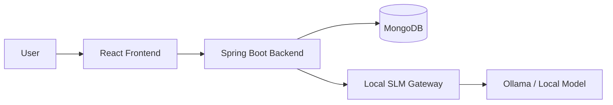
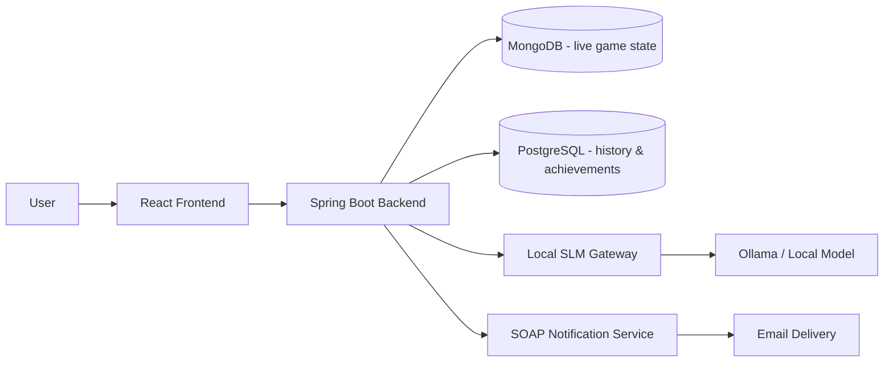

# Poe Pet App

`Poe Pet App` is a virtual-pet web application built primarily as an **educational portfolio project**.  
Its purpose is twofold:

- to practice real-world backend/frontend architecture, refactoring, testing, and deployment thinking
- to produce a project that is substantial enough to present as proof of practical development work

The app combines a classic virtual-pet loop with minigames, customization, economy systems, and an AI-powered pet chat feature backed by a separate local model service.

## Project Summary

At its current stage, the app includes:

- account registration, verification, login, refresh-token auth
- a simulated pet with `hunger`, `happiness`, and `energy`
- a shop, inventory, consumables, cosmetics, and pet customization
- multiple minigames with reward preview logic
- developer-only tools for fast testing
- AI chat, where the pet can respond in-character through a separate model gateway

This repository follows a **docs-first** approach: behavior, plans, and major architecture decisions are tracked in the documentation before deeper implementation work.

## Educational Purpose

This project is intentionally broader than a minimal CRUD demo. It is used to explore:

- backend architecture in Java/Spring Boot
- API design and error handling
- TypeScript/React UI design
- data modeling trade-offs
- refactoring large components/services into clearer structures
- AI integration with a standalone side project
- future plans for SQL, containerization, AWS deployment, and SOAP integration

In other words, this is not just “a pet app”; it is also a structured learning vehicle.

## Tech Stack

### Current stack

- `Java 21`
- `Spring Boot 3`
- `Maven`
- `MongoDB`
- `React`
- `TypeScript`
- `Vite`
- `Vitest`
- `Docker Compose`
- `REST API`
- `Git`

### Side project / AI stack

The AI portion is intentionally separated into its own small project:

- standalone local model gateway
- `Python`
- `FastAPI`
- `Ollama`
- local CPU-oriented SLM experimentation

### Planned future stack expansion

The roadmap explicitly includes:

- `PostgreSQL` for achievements/history/analytics-style data
- full-stack containerization for deployment readiness
- Linux / AWS deployment
- a small SOAP notification side-service

## What Uses What

### Frontend

`frontend/`

- React + TypeScript UI
- game shell, settings, minigames, customization, pet chat UI
- consumes the backend through REST endpoints

### Backend

`backend/`

- Java 21 + Spring Boot 3 API
- authentication, gameplay logic, minigame orchestration, inventory/shop rules
- integrates with MongoDB
- proxies AI chat to the standalone AI gateway

### Data

`mongodb/`

- local MongoDB seed/setup
- current source of truth for flexible gameplay/catalog state

### Documentation

`documentation/`

- architecture decisions
- roadmap
- questions / resolved decisions
- testing strategy
- UI/layout direction

## AI Usage and AI Agents

AI is used in **two different ways** in this project:

### 1. As a product feature

The pet can talk in-character through an AI chat system.  
That chat is powered by a separate side project (`local-slm-gateway`) which runs a local model behind an HTTP API.

### 2. As a development aid

AI agents were used during planning, refactoring, documentation, and implementation support.  
They were treated as **pair-programming / acceleration tools**, not as an excuse to skip review:

- architecture and roadmap decisions were still discussed and revised
- documentation was kept as a human-readable source of truth
- code was tested and iterated on after agent-assisted changes

This is important to state clearly because the project is both:
- an application with an AI feature
- a learning project built with the help of AI-assisted development workflows

## Current Architecture



## Planned Architecture Direction



## Repository Structure

```text
poe-pet-app/
├─ backend/         Spring Boot API and game logic
├─ frontend/        React + TypeScript client
├─ mongodb/         Mongo setup, seeds, migration scripts
├─ documentation/   source-of-truth docs, roadmap, questions, tests
├─ tests/           end-to-end smoke scripts
├─ README.md        project presentation and overview
├─ run-all-tests.ps1
├─ start-all.ps1
└─ start-all.sh
```

Related side project kept separately in the same workspace:

```text
local-slm-gateway/
├─ gateway/         FastAPI gateway for model requests
├─ models/          notes/placeholders for local model experiments
├─ gateway.env      pinned runtime configuration
├─ docker-compose.yml
└─ README.md
```

## Why This Project Is Worth Showing

This app demonstrates more than isolated syntax knowledge. It shows:

- multi-layer application design
- real backend/frontend communication
- database-backed gameplay state
- iterative refactoring and documentation discipline
- integration with a separate AI service
- forward planning for SQL analytics, containerization, AWS deployment, and SOAP interoperability

That makes it useful not only as a toy project, but as a **learning narrative**: it shows how a project can grow from a local PoC into a more complete system.

## Future Plans

The next major phases currently planned are:

- **SQL achievements and history**
  - verbose event tracking with rich metadata
  - permanent achievements first
  - daily challenges added later
  - intentionally structured so future Elasticsearch-style analysis is possible

- **Containerization**
  - one main Compose-based stack for the main app
  - AI model gateway remains its own separate containerized side project

- **AWS deployment**
  - Linux VM / EC2 first
  - cost-conscious deployment path

- **SOAP notification side-service**
  - real email delivery
  - user toggles in settings
  - first notification types:
    - low-hunger reminder
    - daily AI summary

## Documentation

If someone wants the deeper engineering/project plan rather than the presentation overview, the most important docs are:

- `documentation/SOURCE_OF_TRUTH.md`
- `documentation/ROADMAP.md`
- `documentation/QUESTIONS.md`
- `documentation/testing/TEST_STRATEGY.md`
